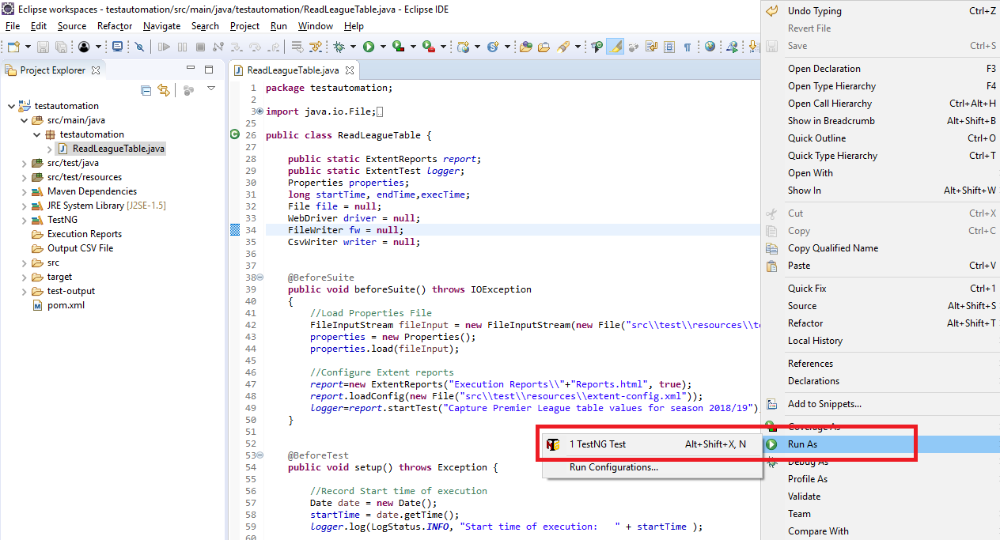
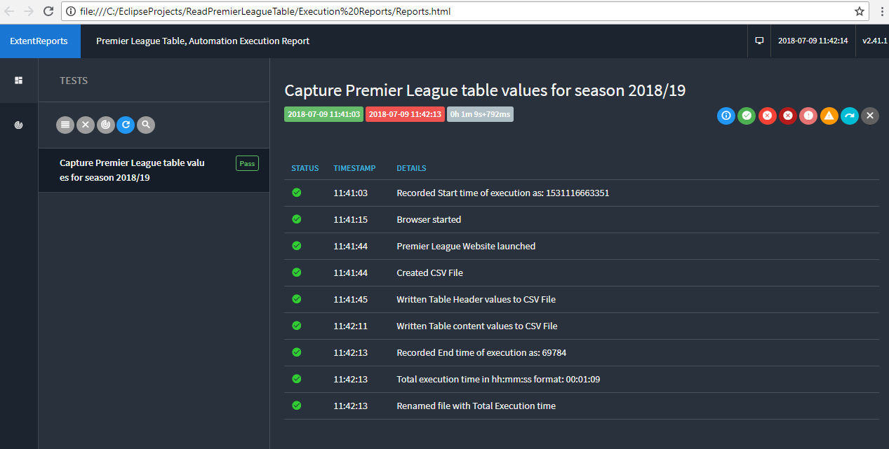
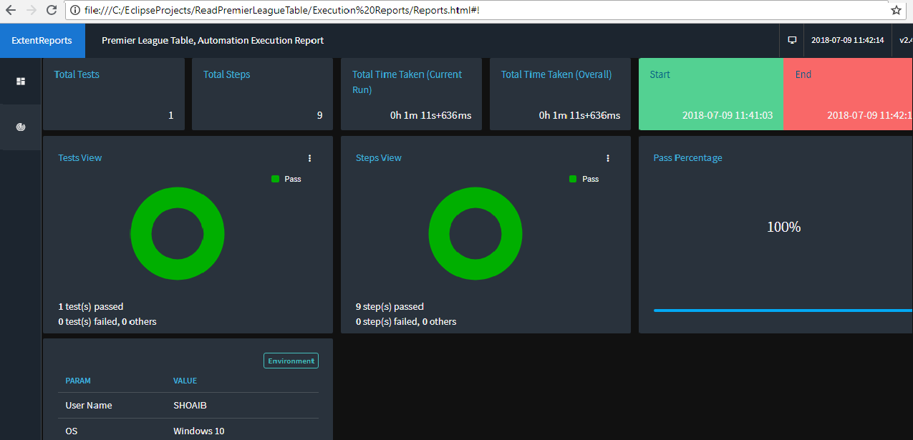
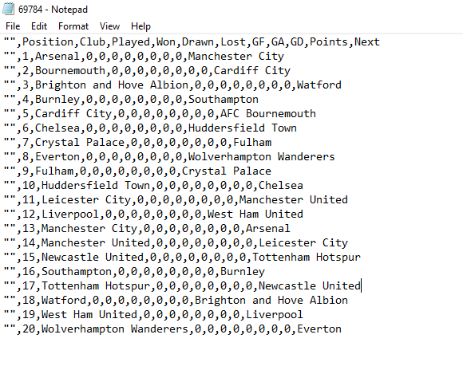

# Overview

This repository contains [Selenium](http://seleniumhq.org/) tests to extract results for Season 2018/19 from the [Premier League App](https://www.premierleague.com/tables).


# Requirements

```
1. Java version - version 8
2. Apache Maven - version 3.5.4
3. Eclipse IDE
4. Maven dependencies 
    * Extent Reports   : version 2.41.2
    * selenium-java    : version 3.12
    * testng           : version 6.14.2
    * javacsv          : version 2.0
       (from sourceforge)
5. Chrome Browser      : version 67.0
6. Chromedriver binary : version 2.40
7. Windows OS       
 ```
       
# Running Selenium tests

1. First of all you need to install JDK version 1.8 for Windows 64 bit in your system and also setup Java Environment variable.To get a detailed guide on how to install Java, Please <a href="https://drive.google.com/open?id=1S_jt7mUKnJakfdZrKIRSzsxTGc-TYMdE">click here</a>

2. Download Maven and Set up Maven Environment Variable. Follow the step by step instructions given in <a href="https://drive.google.com/open?id=1S9pB4Zk7veq_YCDi7w1TMgHv6390ZH1o">this</a> link. 

3. Download and Start Eclipse IDE by following the steps in <a href="https://drive.google.com/open?id=1IaOGHymbUCUBIyTmEwgq8p5D1eGZVGrx">this</a> link. 

4. Clone this repository to your local machine or Download the project.

5. Import the downloaded Maven Project using Eclipse IDE. Steps are detailed in <a href="https://drive.google.com/open?id=1d4JTccc7P7X_zzxdYvby_wzhd4OTWA0M">this</a> link.

6. Download the Chromedrive binary from <a href="http://chromedriver.chromium.org/downloads">Chromium project</a>. See <a href="https://drive.google.com/open?id=1WYRRFy3tuasB5A9u6nQzBpT3egYNXLNw">here</a> for steps

   In order to launch Chrome browser we have to do the following steps:
    
    * Get the location of downloaded Chromedriver.exe file and set the path for **chromedriverPath** in test.properties file available         in the project root folder
    * Set a system property “webdriver.chrome.driver” to the path of your ChromeDriver.exe file
    * Instantiate a ChromeDriver class.

   See the sample code below:
   
     test.properties file sample
   ```
    chromedriverPath=C:\\Users\\SHOAIB\\Desktop\\Chrome Driver\\chromedriver.exe
   ```
   ```
   System.setProperty("webdriver.chrome.driver",properties.getProperty("chromedriverPath"));
   WebDriver driver = new ChromeDriver();
   driver.get("https://www.premierleague.com/tables");
   ```
7. <a href="https://drive.google.com/open?id=1jhwcuI0yNJ34YwbEAPCo-n_yuRTNS7vH
">Install TestNG plugin for Eclipse</a> from Eclipse Marketplace.

8. Open the ReadLeagueTable class file available in the project and Right click, Select Run As -> TestNG option
      
      

# Reporting

Right click on the project and Refresh once the execution is completed.

Then Open Report.html file which is available in Execution Reports folder in the project



# Output CSV File
Right click on the project and Refresh once the execution is completed.

Then Open xxxx.csv file which is available in Output CSV File folder in the project.



